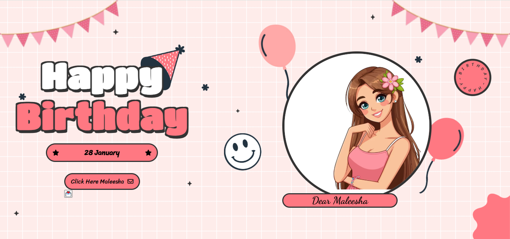
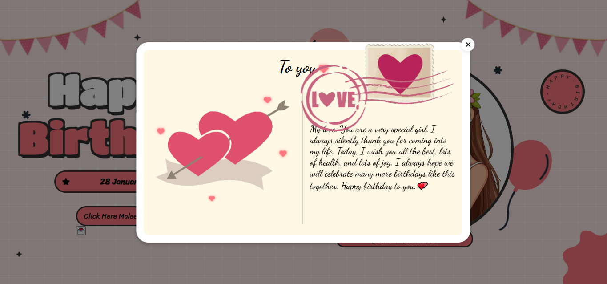
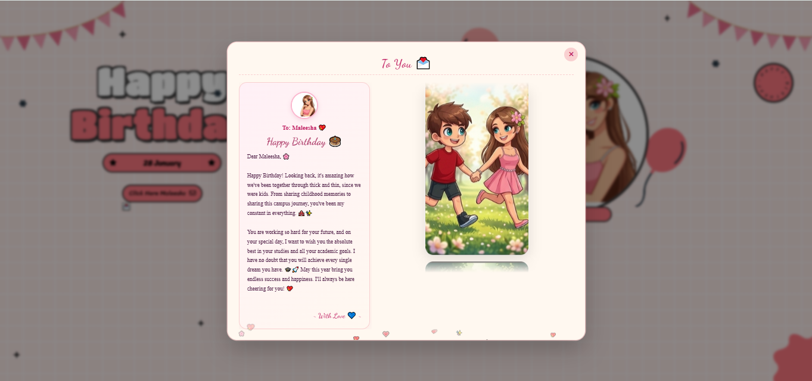

<div align="center">

# Birthday Project

### *A heartfelt interactive birthday surprise*

[](https://thisura-maleesha.github.io/birthday-project/)
[](https://github.com/thisura-maleesha/birthday-project)
[](https://github.com/thisura-maleesha/birthday-project)

</div>

---

## Overview

An interactive, animated birthday webpage built with pure HTML, CSS, and JavaScript. Features a multi-section experience with typewriter effects, a photo memory gallery, and background music — all designed to create a memorable personal surprise.

> *"Some friendships are written in pencil — easily erased. Ours was written in permanent ink, sealed with every laugh, every tear, and every memory we've made together."*

---

## Features

| Feature | Description |
|---|---|
| Animated birthday page | Bouncing letters and falling decorations on load |
| Love letter popup | Typewriter-effect message with synchronized music |
| Memory gallery | Auto-scrolling photo section with smooth transitions |
| Background music | Three unique songs, one for each section |
| Particle effects | Floating hearts and flower animations throughout |
| Responsive design | Optimized for both mobile and desktop |

---

## Preview

| Main Page | Love Letter | Memory Gallery |
|:---:|:---:|:---:|
|  |  |  |

---

## Project Structure

```
birthday-project/
├── index.html              # Main page
├── style.css               # All styles and animations
├── birthday_song.mp3       # Main background music
├── letter_song.mp3         # Letter popup music
├── memories_song.mp3       # Photo gallery music
└── images/
    ├── anime-girl.png
    ├── heart_letter.png
    ├── love.png
    ├── mewmew.png
    ├── balloon1.png
    ├── balloon2.png
    ├── hat.png
    ├── decorate.png
    ├── decorate_flower.png
    ├── smiley_icon.png
    └── 11.png ~ 71.png     # Memory photos
```

---

## Getting Started

**View online:**

👉 [thisura-maleesha.github.io/birthday-project](https://thisura-maleesha.github.io/birthday-project/)

**Run locally:**

```bash
git clone https://github.com/thisura-maleesha/birthday-project.git
cd birthday-project
# Open index.html in your browser
```

No dependencies or build steps required.

---

## Built With

| Technology | Purpose |
|---|---|
| HTML5 | Structure and layout |
| CSS3 | Animations and styling |
| JavaScript | Interactive popups and typewriter effects |
| jQuery | Smooth slide animations |
| Font Awesome | Icons |
| Google Fonts | Dancing Script, Poppins, Caveat |

---

## Author

<div align="center">

**Thisura Maleesha**

🎓 BICT (Hons) — University of Vavuniya, Sri Lanka

[](https://github.com/thisura-maleesha)
[](mailto:thisuramaleesha099@gmail.com)

</div>

---

<div align="center">
<sub>A personal project, crafted with genuine care — Happy Birthday, Maleesha.</sub>
</div>
